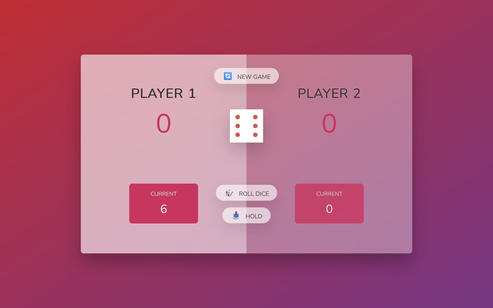

# Pig Game 🎲

Welcome to the **Pig Game**! This is a fun, interactive web-based dice game where players take turns to roll the dice and accumulate points. The first player to reach 21 points wins the game! It's built using [React JS](https://create-react-app.dev/) and hosted on [Vercel](https://vercel.com/).

<br>

## 🚀 Live Demo

Check out the live version of the game:
[https://pig-game-kez.vercel.app/](https://pig-game-kez.vercel.app/).

## 🛠️ Features

- **Interactive UI**: Easy-to-use interface with real-time score updates.
- **Dice Rolling**: Players take turns rolling the dice to accumulate points.
- **Hold and Win**: Players can choose to hold their score and pass the turn to the opponent.
- **Simple and Engaging**: A straightforward game designed for fun and quick play sessions.

## 💻 Technologies Used

- **Frontend**: React.js, CSS
- **Hosting**: Vercel
- **Tooling**: Create React App

## 🎯 How to Play

1. Visit the [live demo](https://pig-game-kez.vercel.app/).
2. The game requires two players. Player 1 starts by rolling the dice.
3. Each roll adds the rolled number to the player's current score, unless a `1` is rolled. If a `1` is rolled, the current score is lost, and it's the next player's turn.
4. Players can choose to "Hold" their score, adding it to their total score, and pass the turn to the opponent.
5. The first player to reach **21 points** wins the game.
6. Click the "New Game" button to reset the game and start a new round.

## 📸 Screenshots



## 🔧 Installation

If you want to run this project locally, follow these steps:

1. Clone the repository:
   ```bash
   git clone https://github.com/Kezota/pig-game.git
   ```
2. Navigate to the project directory:
   ```bash
   cd pig-game
   ```
3. Install the dependencies:
   ```bash
   npm install
   ```
4. Start the development server:
   ```bash
   npm start
   ```
5. Open `http://localhost:3000` in your browser to view the game.

## 👏 Credits

This project was built using templates and designs provided by [Jonas Schmedtmann](https://github.com/jonasschmedtmann)

## 🤝 Contributing

If you'd like to contribute to the development of this project, feel free to fork the repository and submit a pull request. Contributions are always welcome!
